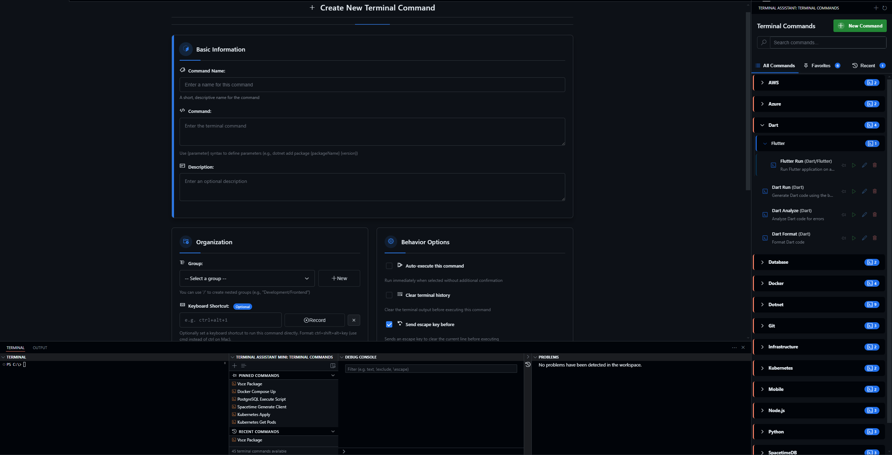

# Terminal Assistant

## Overview
Terminal Assistant is a Visual Studio Code extension that allows you to save and execute predefined terminal commands with a few clicks, improving productivity and workflow efficiency.

<em>Click the image to view full size</em>

## Features

### Modern Command Interface
- **Visual Command Browser**: Browse your commands in a sleek, collapsible tree view with icons
- **Interactive Actions**: Run, edit, or delete commands directly from the interface
- **Group Management**: Automatically organize commands in expandable/collapsible groups
- **Rich Command Display**: See command descriptions, groups, and execution details at a glance
- **Panel View Option**: Access your commands from both the activity bar or a minimized panel view

### Command Management
- **Customizable Commands**: Store frequently used terminal commands with custom labels and descriptions
- **Command Organization**: Group commands in a hierarchical structure with nested groups (e.g., "Development/Frontend/React")
- **Parameterized Commands**: Define dynamic parameters using {parameter} syntax with descriptions and default values
- **Execution Modes**: Choose between auto-execute (run immediately) or manual execute (just insert the command)
- **Quick Pick Command**: Access your commands quickly with Ctrl+Shift+A (Cmd+Shift+A on Mac)

### Terminal Handling
- **Smart Terminal Mode**: Choose how terminals are handled when executing commands:
  - Reuse existing terminals (default)
  - Always create new terminals
  - Smart reuse based on terminal state
- **Task Terminal Behavior**: Configure how commands interact with read-only task terminals
- **Auto-close Task Prompts**: Automatically dismiss "press any key to close" prompts

### Enhanced Search Experience
- **Instant Search**: Filter commands as you type with real-time results
- **Full-text Search**: Find commands by name, description, command text, or group
- **Visual Feedback**: Clearly see which commands match your search criteria
- **Search Persistence**: Search state is preserved when switching between views

### Storage Options
- **Workspace Storage**: Keep commands specific to individual projects
- **Global Storage**: Share commands across all your workspaces
- **Easy Toggling**: Switch between storage locations with a simple command

### Command-Specific Keyboard Shortcuts
You can now assign keyboard shortcuts to individual terminal commands:

1. When creating or editing a command, use the "Keyboard Shortcut" field
2. Either type your desired shortcut or click "Record Keys" to capture keystrokes
3. Save the command and the shortcut will be registered automatically

This allows you to execute your most frequently used commands with a quick keystroke, without even opening the Terminal Assistant panel.

**Note:** If a shortcut conflicts with an existing VS Code keybinding, the Terminal Assistant shortcut may not work. Choose unique combinations to avoid conflicts.

### Parameter Support
- **Dynamic Inputs**: Automatically prompts for parameter values when running commands
- **Default Values**: Define default values for parameters to speed up execution
- **Parameter Descriptions**: Add helpful descriptions to make parameters more user-friendly

## Command Editor
The Terminal Assistant provides an intuitive command editor for creating and configuring your terminal commands.

## Installation

### From VS Code Marketplace
1. Open VS Code
2. Go to Extensions (Ctrl+Shift+X)
3. Search for "Terminal Assistant"
4. Click Install

## Usage

### Adding Commands
1. Click on the Terminal Assistant icon in the activity bar
2. Click the "Add Command" button in the toolbar
3. Fill in the command details:
   - **Name**: A descriptive name for your command
   - **Command**: The actual terminal command to execute
   - **Description**: Helpful description of what the command does
   - **Group**: Organize commands into logical groups (use "/" for nested groups)
   - **Parameters**: Use {paramName} syntax to define dynamic inputs
   - **Auto-execute**: Toggle whether the command runs automatically or just inserts
   - **Keyboard Shortcut**: Optional keyboard shortcut to quickly run the command

### Running Commands
1. Click on a command in the Terminal Assistant sidebar to execute it
2. Use the global shortcut Ctrl+Shift+A (Cmd+Shift+A on Mac) to open a quick pick menu of commands
3. Alternatively, use the "Run" button (play icon) next to each command
4. If your command has parameters, you'll be prompted to fill them in
5. The command will be executed in your terminal (or just inserted if auto-execute is disabled)

### Terminal Management
1. Use the "Create New Terminal" command to create a fresh terminal
2. Configure your preferred terminal behavior in the extension settings
3. Use "Execute Command in New Terminal" when you need to run in a clean environment
4. Adjust "Terminal Mode" settings to control how terminals are created and reused

### Organizing and Finding Commands
1. **Grouping**: Commands are automatically organized by their group hierarchy
2. **Collapsing/Expanding**: Click on group headers to collapse or expand groups
3. **Searching**: Use the search box at the top to filter commands as you type
4. **Keyboard Shortcut**: Press your assigned keyboard shortcuts to run commands directly

### Command Management
- Use the edit icon (pencil) to modify existing commands
- Use the delete icon (trash) to remove commands (with confirmation)
- Use the search feature to quickly find commands across all groups
- Use "Show Registered Shortcuts" to see all your custom command shortcuts

### Managing Storage Location
- Use the command "Terminal Assistant: Toggle Command Storage Location" to switch between workspace and global storage
- Workspace storage keeps commands in a JSON file in your project
- Global storage makes commands available across all your projects

## Configuration Options
Terminal Assistant provides several configuration options to customize your experience:

- **Storage Location**: Choose where commands are stored (workspace or global)
- **Task Terminal Behavior**: Configure how to handle commands when a read-only task terminal is active
- **Auto Close Task Prompts**: Automatically dismiss terminal prompts
- **Terminal Mode**: Control how terminals are created and reused when executing commands

Access these settings through VS Code's Settings UI or settings.json file.

## Example Use Cases
- Running complex build scripts with different configuration parameters
- Starting development servers with specific port and environment settings
- Executing database operations with different targets
- Running test suites with various filters and flags
- Creating standardized Git commit messages with parameters
- Any repetitive terminal tasks that require slight variations

## Compatibility
Terminal Assistant works in both trusted and untrusted workspaces, with some limitations in untrusted environments for security reasons.

## License
This project is licensed under the MIT License - see the [LICENSE](LICENSE) file for details.

## Support the Project
If you find Terminal Assistant useful and would like to support its development, you can buy me a coffee! Your support helps maintain this extension and develop new features.

## Issues and Contributions
Found a bug or have a feature request? Please submit an issue on our [GitHub repository](https://github.com/SancaK9/WardeR.TerminalAssistant/issues).

Thank you for your support! ☕