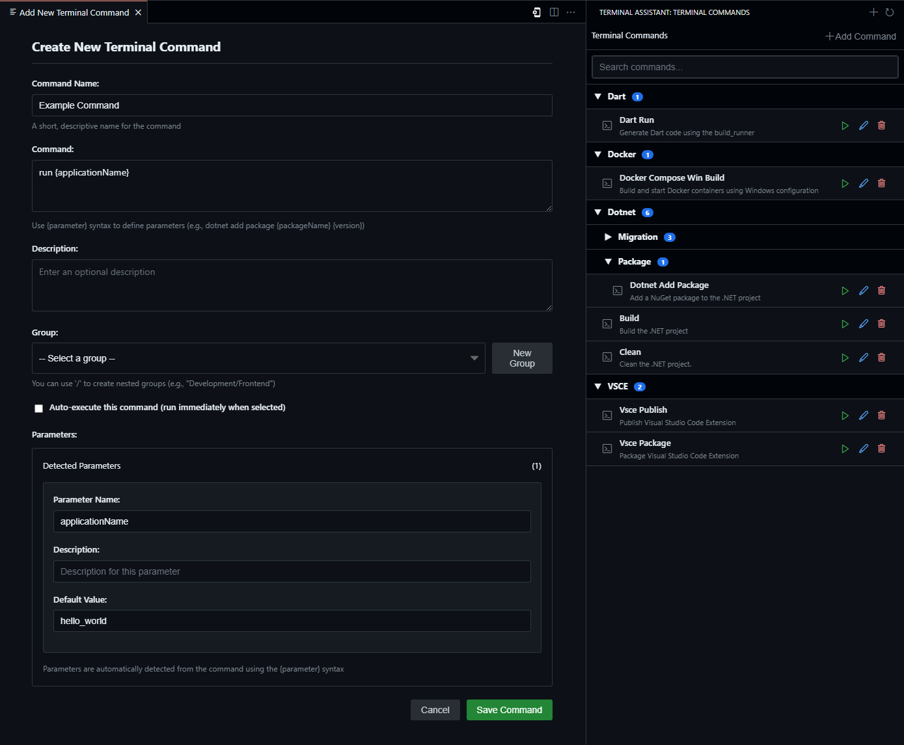

# Terminal Assistant

## Overview
Terminal Assistant is a Visual Studio Code extension that allows you to save and execute predefined terminal commands with a few clicks, improving productivity and workflow efficiency.

## Command Editor
The Terminal Assistant provides a powerful command editor for creating and configuring your terminal commands:

## Features

### Command Management
- **Customizable Commands**: Store frequently used terminal commands with custom labels and descriptions
- **Command Organization**: Group commands in a hierarchical structure with nested groups (e.g., "Development/Frontend/React")
- **Parameterized Commands**: Define dynamic parameters using {parameter} syntax with descriptions and default values
- **Execution Modes**: Choose between auto-execute (run immediately) or manual execute (just insert the command)

### User Interface
- **Modern Sidebar View**: Access all commands from the dedicated Terminal Assistant panel in VS Code
- **Hierarchical Display**: Commands are organized in collapsible groups and subgroups
- **Visual Command Editor**: Create and edit commands with an intuitive form interface
- **Contextual Actions**: Quick actions for running, editing, and removing commands

### Storage Options
- **Workspace Storage**: Keep commands specific to individual projects
- **Global Storage**: Share commands across all your workspaces
- **Easy Toggling**: Switch between storage locations with a simple command

### Search and Access
- **Powerful Search**: Find commands by name, description, command text, or group
- **Command Palette Integration**: Access commands from VS Code's command palette
- **Group Filtering**: Quickly filter commands by their group or subgroup

### Parameter Support
- **Dynamic Inputs**: Automatically prompts for parameter values when running commands
- **Default Values**: Define default values for parameters to speed up execution
- **Parameter Descriptions**: Add helpful descriptions to make parameters more user-friendly

### Command-Specific Keyboard Shortcuts
You can now assign keyboard shortcuts to individual terminal commands:

1. When creating or editing a command, use the "Keyboard Shortcut" field
2. Either type your desired shortcut or click "Record Keys" to capture keystrokes
3. Save the command and the shortcut will be registered automatically

This allows you to execute your most frequently used commands with a quick keystroke, without even opening the Terminal Assistant panel.

**Note:** If a shortcut conflicts with an existing VS Code keybinding, the Terminal Assistant shortcut may not work. Choose unique combinations to avoid conflicts.

## Installation

### From VS Code Marketplace
1. Open VS Code
2. Go to Extensions (Ctrl+Shift+X)
3. Search for "Terminal Assistant"
4. Click Install

## Usage

### Adding Commands
1. Click on the Terminal Assistant icon in the activity bar
2. Click the + icon to add a new command
3. Fill in the command details:
   - **Name**: A descriptive name for your command
   - **Command**: The actual terminal command to execute
   - **Description**: Helpful description of what the command does
   - **Group**: Organize commands into logical groups (use "/" for nested groups)
   - **Parameters**: Use {paramName} syntax to define dynamic inputs
   - **Auto-execute**: Toggle whether the command runs automatically or just inserts

### Running Commands
1. Click on a command in the Terminal Assistant sidebar to execute it
2. If your command has parameters, you'll be prompted to fill them in
3. The command will be executed in your terminal (or just inserted if auto-execute is disabled)

### Managing Commands
- Use the edit icon to modify existing commands
- Use the delete icon to remove commands
- Use the search box to quickly find commands
- Collapse or expand groups to organize your view

### Managing Storage Location
- Use the command "Terminal Assistant: Toggle Command Storage Location" to switch between workspace and global storage
- Workspace storage keeps commands in a JSON file in your project
- Global storage makes commands available across all your projects

## Example Use Cases
- Running complex build scripts with different configuration parameters
- Starting development servers with specific port and environment settings
- Executing database operations with different targets
- Running test suites with various filters and flags
- Any repetitive terminal tasks that require slight variations

## License
This project is licensed under the MIT License - see the [LICENSE](LICENSE) file for details.

## Support the Project
If you find Terminal Assistant useful and would like to support its development, you can buy me a coffee! Your support helps maintain this extension and develop new features.

Thank you for your support! ☕