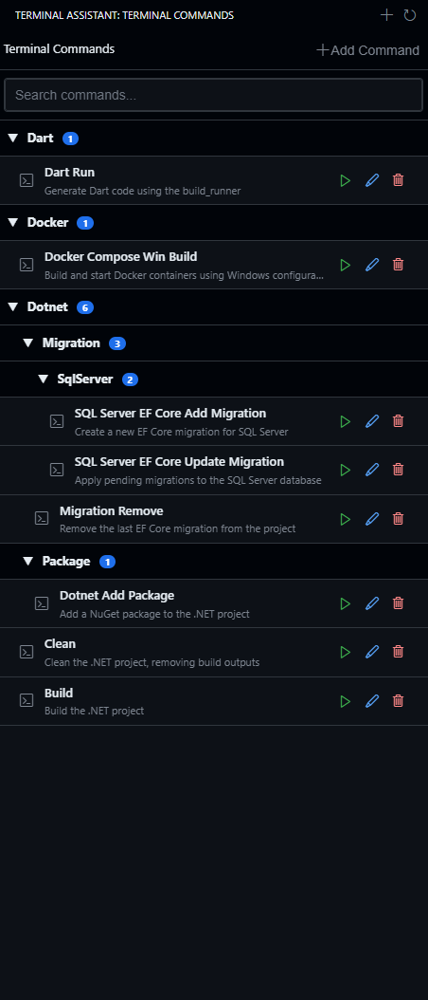
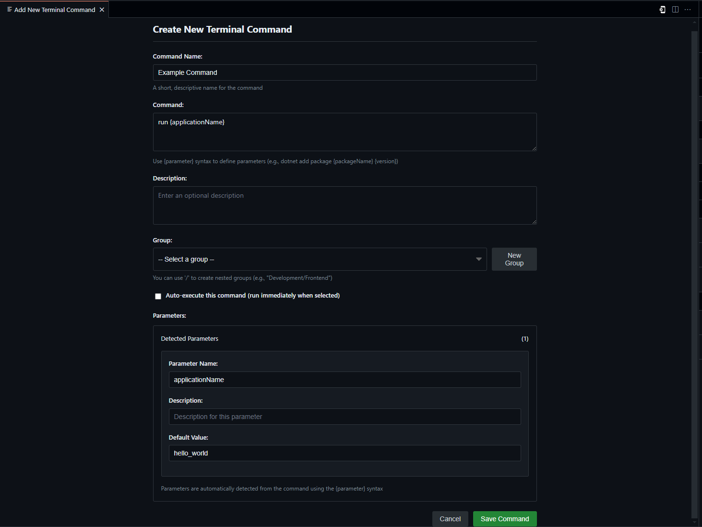

# Terminal Assistant

## Overview
Terminal Assistant is a Visual Studio Code extension that allows you to save and execute predefined terminal commands with a few clicks, improving productivity and workflow efficiency.

## Features
- **Command Management**
  - Store frequently used terminal commands with custom labels and descriptions
  - Organize commands into groups for better organization
  - Parameterize commands with custom placeholders
  - Choose between auto-execute or manual execute mode
  
- **Easy Access**
  - Execute commands directly from the dedicated sidebar view
  - Find commands quickly with built-in search functionality
  - Access commands from VS Code command palette
  
- **Rich UI**
  - Visual command editor for easier command configuration
  - Tree view showing commands organized by groups
  - Context menu actions for editing and removing commands

## Command Editor
The Terminal Assistant provides a powerful command editor for creating and configuring your terminal commands:

## Installation

### From VS Code Marketplace
1. Open VS Code
2. Go to Extensions (Ctrl+Shift+X)
3. Search for "Terminal Assistant"
4. Click Install

## Usage

### Adding Commands
1. Click on the Terminal Assistant icon in the activity bar
2. Click the + icon to add a new command
3. Fill in the command details:
- Name: A descriptive name for your command
- Command: The actual terminal command to execute
- Description (Optional): Helpful description of what the command does
- Group: Organize commands into logical groups
- Parameters: Use {paramName} syntax in your commands to create dynamic inputs

### Running Commands
1. Click on a command in the Terminal Assistant sidebar to execute it
2. If your command has parameters, you'll be prompted to fill them in
3. The command will be executed in your terminal (or just inserted if auto-execute is disabled)

### Managing Commands
- Use the edit icon to modify existing commands
- Use the delete icon to remove commands
- Use the search icon to quickly find commands

## Example Use Cases
- Running complex build scripts with different configuration parameters
- Starting development servers with specific port and environment settings
- Executing database operations with different targets
- Running test suites with various filters and flags
- Any repetitive terminal tasks that require slight variations

## License
This project is licensed under the MIT License - see the [LICENSE](LICENSE) file for details.